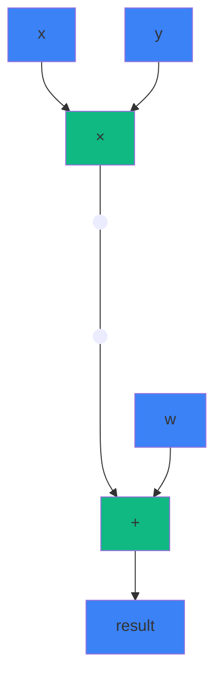
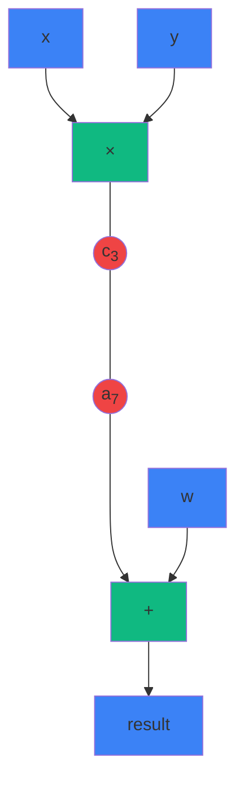

# Entonces... ¡ya está!




::right::

---
layout: two-cols
---

# Entonces... ¿ya está?





::right::

(3) $\;\;c_3 = a_3 \times b_3$

(7) $\;\;c_7 = a_7 \times b_7$


Dado $\vec{w} = [w_0, w_1, ..., w_{n-1}]$

<div class="mt-8 p-6 bg-blue-500/10 rounded-lg inline-block text-left">

- $w_5 = w_{12}$
- $w_2 = w_3 = w_7$

</div>


---
layout: center
---

# Warmup: Chequeo de Permutaciones

<div class="text-center mt-12">

Dados dos vectores $\vec{p}$ y $\vec{q}$

<div class="mt-8 text-2xl">

¿Cómo probar que $\vec{q}$ es una permutación de $\vec{p}$?

</div>

<v-click>

<div class="mt-12 p-6 bg-blue-500/10 rounded-lg inline-block">

**Idea clave:** Un producto "olvida" el orden pero "recuerda" qué elementos están presentes

</div>

</v-click>

</div>

<!--
Ejemplo: p = [1, 2, 3, 4] y q = [3, 1, 4, 2]
Claramente q es permutación de p.

Pero: p = [1, 2, 3, 4] y q = [1, 2, 3, 5]
Aquí q NO es permutación (tiene 5 en lugar de 4).

¿Cómo verificamos esto eficientemente?

CLICK: La idea clave es usar PRODUCTOS.

Si multiplico todos los elementos de p: 1 × 2 × 3 × 4 = 24
Si multiplico todos los elementos de q: 3 × 1 × 4 × 2 = 24
Si q = [1, 2, 3, 5], el producto sería 1 × 2 × 3 × 5 = 30 ≠ 24

Vamos a usar esta idea de forma más sofisticada con el "truco del producto".
-->

---

# El Truco del Producto

<div class="grid grid-cols-2 gap-8 mt-8">

<div>

## Construir factores

$f = \prod_{i=1}^{n} (x - p_i)$

$g = \prod_{i=1}^{n} (x - q_i)$

<div class="mt-6 p-4 bg-green-500/10 rounded">

$\vec{q}$ es permutación de $\vec{p}$ $\iff$ $f = g$

</div>

</div>

<div>

<v-click>

## En la práctica

<div class="mt-4">

```python
Z[0] = 1
for i in range(n):
    Z[i+1] = Z[i] · (γ + p[i])
                   / (γ + q[i])
```

</div>

<div class="mt-4 p-4 bg-blue-500/10 rounded text-sm">

$\vec{q}$ es permutación de $\vec{p}$ $\iff$ $Z[n] = 1$

</div>

</v-click>

</div>

</div>

<!--
El "truco del producto" funciona así:

En lugar de multiplicar los elementos directamente, construimos factores (γ + p_i).
γ es un challenge aleatorio que nos da el verifier (lo veremos más adelante).

Para p, construyo: f = (γ + p₁) × (γ + p₂) × ... × (γ + pₙ)
Para q, construyo: g = (γ + q₁) × (γ + q₂) × ... × (γ + qₙ)

PROPIEDAD FUNDAMENTAL (es un si y solo si):
- Si q es permutación de p → f = g (porque tienen exactamente los mismos factores)
- Si q NO es permutación → f ≠ g con probabilidad abrumadora (por Schwartz-Zippel)

El γ es crucial: sin él, podríamos tener colisiones. Por ejemplo:
p = [2, 3] tiene producto 6
q = [1, 6] también tiene producto 6, ¡pero no son permutaciones!

Con γ aleatorio, esto es extremadamente improbable.

EN LA PRÁCTICA:
No expandimos los productos (sería costoso). Usamos productos ACUMULATIVOS:
- Empezamos con Z[0] = 1
- En cada paso: multiplicamos por (γ + p[i]) y dividimos por (γ + q[i])
- Si son permutaciones, al final Z[n] = 1

¿Por qué? Porque cada factor que multiplicamos también lo dividimos (en distinto orden).
-->

---
layout: center
---

# Del Chequeo de Permutaciones a Copy Constraints

<div class="grid grid-rows-3 gap-8 mt-8">

<v-click>
<div class="text-center mt-8 p-4 bg-blue-500/10 rounded text-sm">

Queremos forzar algunos $w_i = w_j$

</div>


</v-click>

<v-click>
<div class="text-center mt-8 p-4 bg-red-500/10 rounded text-sm">

Construimos permutación σ<br/>(ciclos para cada cable)

</div>
</v-click>

<v-click>
<div class="text-center mt-8 p-4 bg-green-500/10 rounded text-sm">
Usamos el truco del producto
</div>
</v-click>

</div>

<!--
Ahora conectemos esto con nuestro problema original:

Tenemos un vector de valores w (el wire vector con todos los valores del circuito).
Queremos forzar que ciertas posiciones tengan el mismo valor.

Por ejemplo: w[5], w[12], y w[23] deben ser iguales (representan el mismo cable).

¿Cómo usamos el chequeo de permutaciones para esto?

La estrategia tiene tres pasos:
1. Crear una permutación σ que codifique qué posiciones deben ser iguales
2. Transformar el problema "estos valores deben ser iguales" en "este vector es permutación de este otro"
3. Usar el truco del producto para verificar la permutación

Veamos cómo...
-->

---

# Codificando Copy Constraints

<div class="grid grid-cols-2 gap-8 mt-8">

<div>

## Ejemplo

Valores: $w = [x, y, z, z, w, z, r]$

<div class="mt-4">

Restricción:
- $w[2] = w[3] = w[5]$ (el cable $z$)

</div>

<v-click>

<div class="mt-6 p-4 bg-blue-500/10 rounded">

**Idea:** Crear una permutación $\sigma$ que agrupe las posiciones que deben ser iguales

</div>

</v-click>

</div>

<div>

<v-click at="2">

## La Permutación $\sigma$

<div class="mt-4">

Sin restricciones:
```
σ = [0, 1, 2, 3, 4, 5, 6]  (identidad)
```

</div>

<div class="mt-4">

Con restricción $w[2] = w[3]$:
```
σ = [0, 1, 5, 2, 4, 3, 6]
```

</div>

<div class="mt-6 text-sm opacity-80">

Intercambiamos 2 y 3 para formar un "ciclo"

</div>

</v-click>

</div>

</div>

<!--
Veamos cómo codificamos las copy constraints:

Tengo un vector w con todos los valores del circuito: [x, y, z, z, w, r]
Quiero que w[2] = w[3] (ambas posiciones representan el cable z).

La idea: creo una permutación σ que conecta las posiciones que deben ser iguales.

Sin restricciones, σ sería la identidad: [0, 1, 2, 3, 4, 5]
Cada posición apunta a sí misma.

Con la restricción w[2] = w[3], creo un "ciclo":
σ = [0, 1, 3, 2, 4, 5]

Fíjense: σ[2] = 3 y σ[3] = 2.
Es un ciclo que conecta las posiciones 2 y 3.

Si tuviera más restricciones (ej: w[2] = w[3] = w[5]),
el ciclo sería más largo: σ[2] = 3, σ[3] = 5, σ[5] = 2.

Esta permutación σ codifica todas nuestras copy constraints.
-->

---

# Codificando Copy Constraints (cont.)

<div class="mt-8">

<v-click>

<div class="p-6 bg-purple-500/10 rounded-lg mb-8">

**Observación clave:**

Las copy constraints se satisfacen $\iff$

los pares $(i, w_i)$ son una permutación de los pares $(i, \sigma(w_i))$

</div>

</v-click>

<v-click>

<div class="grid grid-cols-2 gap-8">

<div class="p-4 bg-blue-500/10 rounded">

Permutar valores $(i, w_i) \mapsto (i, \sigma(w_i))$

es lo mismo que...

</div>

<div class="p-4 bg-green-500/10 rounded">

Permutar índices

$(i, w_i) \mapsto (\sigma(i), w_i)$

manteniendo valores fijos

</div>

</div>

</v-click>

</div>

<!--
Ahora viene la parte brillante. Vamos paso a paso:

CLICK 1: OBSERVACIÓN CLAVE
Las copy constraints dicen: "ciertos valores deben ser iguales en ciertas posiciones"
Esto es equivalente a decir: "los PARES (índice, valor) en ciertas posiciones
deben reorganizarse según σ"

Si w[2] = w[3] y σ forma el ciclo 2→3→2, entonces:
- El par (2, w[2]) debe "ir" a la posición donde σ(2) = 3
- El par (3, w[3]) debe "ir" a la posición donde σ(3) = 2

Si las copy constraints se cumplen (w[2] = w[3]), esto es una permutación válida.
Si NO se cumplen (w[2] ≠ w[3]), NO es una permutación.

CLICK 2: SIMPLIFICACIÓN
Permutar pares (i, w[i]) ↔ (σ(i), w[i]) es lo mismo que:
- Mantener los valores w[i] fijos
- Permutar solo los índices: i ↔ σ(i)

Esto es más fácil de trabajar.

CLICK 3: CODIFICACIÓN CON EL TRUCO DEL PRODUCTO
Para codificar el par (índice, valor) en un solo número, usamos:
γ·índice + valor

Donde γ es el challenge aleatorio del verifier.

Entonces:
- p[i] = γ·i + w[i]  (par original)
- q[i] = γ·σ(i) + w[i]  (par con índice permutado)

Con alta probabilidad (gracias a γ aleatorio), estos códigos son únicos.
Y ahora podemos usar el permutation check que ya conocemos!
-->

---

# El Truco: Multiplicar por Índices

<div class="mt-8">

<div class="grid grid-cols-2 gap-8">

<div>

## Vector Original

$$p_i = \gamma \cdot i + w_i$$

<div class="text-sm opacity-70 mt-2">

Cada elemento = índice + valor

</div>

</div>

<div>

## Vector Permutado

$$q_i = \gamma \cdot \sigma(i) + w_i$$

<div class="text-sm opacity-70 mt-2">

Mismo valor, índice permutado

</div>

</div>

</div>

<v-click>

<div class="mt-12 p-6 bg-green-500/10 rounded-lg">

**Propiedad mágica:** Si todos los $w_i$ en el ciclo son iguales, entonces $\vec{q}$ es permutación de $\vec{p}$

</div>

</v-click>

</div>

<!--
Ahora viene el truco brillante de PLONK:

En lugar de solo chequear w directamente, construimos vectores p y q donde:
- p[i] = γ·i + w[i]  (índice original + valor)
- q[i] = γ·σ(i) + w[i]  (índice permutado + valor)

γ es un challenge aleatorio del verifier.

¿Por qué esto funciona?

Si las copy constraints se cumplen (es decir, todos los w[i] en un ciclo son iguales),
entonces q es exactamente una permutación de p.

Ejemplo: si w[2] = w[3] = 5, y σ forma ciclo 2→3→2:
- p[2] = γ·2 + 5
- p[3] = γ·3 + 5
- q[2] = γ·σ[2] + w[2] = γ·3 + 5
- q[3] = γ·σ[3] + w[3] = γ·2 + 5

Vemos que q[2] = p[3] y q[3] = p[2]. Es una permutación.

Si w[2] ≠ w[3], entonces q NO sería permutación de p (con alta probabilidad).
-->

---
layout: center
---

# Agregando Zero Knowledge

<div class="mt-12 text-xl text-center">

Hasta ahora: el protocolo es seguro y completo

Pero... ¿es zero knowledge?

</div>

<v-click>

<div class="mt-8 p-6 bg-red-500/10 rounded-lg text-lg">

❌ Los polinomios revelan información sobre el witness

</div>

</v-click>

<!--
Hasta ahora hemos construido un protocolo que funciona:
- Es SOUND: un prover deshonesto no puede hacer trampa
- Es COMPLETE: un prover honesto siempre puede probar statements verdaderos

Pero falta la tercera propiedad: ZERO KNOWLEDGE.

El problema: cuando el prover envía commitments a los polinomios,
y el verifier los evalúa en puntos aleatorios, potencialmente se puede
aprender información sobre el witness.

Por ejemplo, si evaluamos el polinomio de witness en suficientes puntos,
podríamos reconstruir el polinomio completo y aprender todos los valores secretos.

Necesitamos agregar "ruido" o "randomness" para ocultar el witness.
-->

---

# La Solución: Blinding Factors

<div class="mt-8">

<div class="grid grid-cols-2 gap-8">

<div>

## Sin ZK

$w(X) = \sum_{i=0}^{n-1} w_i \cdot L_i(X)$

<div class="text-sm opacity-70 mt-4">

Polinomio determinístico

</div>

</div>

<div>

<v-click>

## Con ZK

$w'(X) = w(X) + r_1 \cdot X^n + r_2 \cdot X^{n+1}$

<div class="text-sm opacity-70 mt-4">

$r_1, r_2$ aleatorios ocultan el witness

</div>

</v-click>

</div>

</div>

<v-click at="1">

<div class="mt-12 p-6 bg-blue-500/10 rounded-lg">

**Propiedad clave:** En el dominio $H = \{1, \omega, \omega^2, ..., \omega^{n-1}\}$:

$w'(\omega^i) = w(\omega^i)$ para todo $i$

Los términos extra se anulan porque $\omega^n = 1$

</div>

</v-click>

</div>

<!--
La solución: BLINDING FACTORS.

Sin ZK:
- El polinomio w(X) codifica directamente los valores del witness
- Es completamente determinístico dado el witness

Con ZK:
- Agregamos términos de alto grado multiplicados por valores aleatorios r₁, r₂
- w'(X) = w(X) + r₁·X^n + r₂·X^(n+1)

¿Por qué esto funciona?

1. En los puntos de evaluación del dominio H (las raíces de la unidad):
   - ω^n = 1 (por definición de las raíces n-ésimas de la unidad)
   - Entonces X^n evaluado en ω^i es (ω^i)^n = ω^(ni) = (ω^n)^i = 1^i = 1
   - Y X^(n+1) evaluado en ω^i es ω^i

   Pero lo importante: los términos extra son múltiplos del polinomio de vanishing Z_H(X)
   que es cero en todos los puntos del dominio H.

2. Fuera del dominio H:
   - Los términos aleatorios hacen que w'(X) parezca completamente aleatorio
   - Imposible recuperar w(X) original

3. El verifier solo evalúa en puntos aleatorios fuera de H:
   - Ve valores que parecen aleatorios
   - No puede aprender nada sobre el witness
-->

---

# Blinding en la Práctica

<div class="mt-8">

Agregamos blinding a:

<div class="mt-6 space-y-4">

<v-click>

<div class="p-4 bg-blue-500/10 rounded">

**Polinomios de witness:** $a'(X), b'(X), c'(X)$

```
a'(X) = a(X) + r₁·Xⁿ + r₂·Xⁿ⁺¹
b'(X) = b(X) + r₃·Xⁿ + r₄·Xⁿ⁺¹
c'(X) = c(X) + r₅·Xⁿ + r₆·Xⁿ⁺¹
```

</div>

</v-click>

<v-click>

<div class="p-4 bg-purple-500/10 rounded">

**Polinomio de permutación:** $Z'(X)$

```
Z'(X) = Z(X) + r₇·Xⁿ + r₈·Xⁿ⁺¹ + r₉·Xⁿ⁺²
```

</div>

</v-click>

</div>

</div>

<!--
En la práctica, agregamos blinding factors a varios polinomios:

1. POLINOMIOS DE WITNESS (a, b, c):
   - Cada uno de los tres polinomios de witness (entradas izq, der, y salida)
   - Agregamos 2 blinding factors a cada uno: r₁, r₂ para a(X), etc.
   - 6 valores aleatorios en total para los witnesses

2. POLINOMIO DE PERMUTACIÓN Z:
   - Este es el polinomio del grand product que vimos antes
   - Necesita 3 blinding factors (un poco más por razones técnicas)
   - r₇, r₈, r₉

3. POLINOMIO QUOTIENT:
   - El quotient polynomial t(X) que veremos en la parte 3
   - También necesita blinding

IMPORTANTE:
- Todos estos valores r son aleatorios, generados por el prover
- Son secretos, nunca se revelan
- El verifier solo ve commitments y evaluaciones en puntos aleatorios
- El blinding hace imposible recuperar el witness original

Costo: unos pocos valores aleatorios extra, overhead mínimo.
-->

---
layout: end
---

# Preguntas sobre Copy Constraints?

