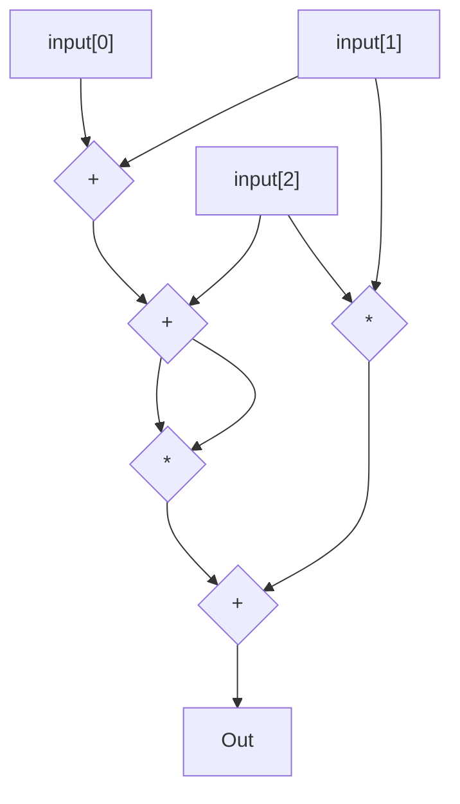
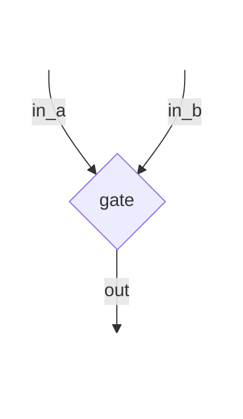

# Vamos por partes

<v-click>

### ¿Que es plonk?

</v-click>

<v-clicks>

- Mas allá de la definición formal, es un método muy piola
    para demostrar cómputo.

- Hay una parte de plonk que es modular (el método para caomprometerse a un polinomio). Pero acá vamos a asumir kzg (la cosa de pairings que nos explicó el chino)

</v-clicks>

---
layout: image-right
image: /img/rompecabezas.png
transition: slide-left
---

# Vamos por partes

### Funcionamiento a lo bruto


<v-clicks>

- Primero que nada me llueve un trusted setup del cielo.
- Genero la traza (o witness si quiero sonar cool).
- Guardo la traza adentro de un polinomio.
- Demuestro que ese polinomio existe sin compartirlo.

- Esos 4 pasos son magia pura. Hoy vamos a tratar de que esa magia tenga un chorro de realidad y máxima ciencia (no se preocupen, algo de magia siempre queda).

</v-clicks>

---
layout: default
transition: none
---

# Hablemos del trusted setup

<v-clicks>

- Tenemos una curva Elíptica $E$
- Tenemos un generador $G$
- Tenemos un polinomio sobre nuestra curva elíptica de la forma $P(x) = 3x^3 + 2x^2 - 5$
- En algún momento nuestra prueba va a requerir que alguien evalúe un polinomio parecido a $P$ (pero mas grande) en un múltiplo de $G$ sin saber que múltiplo es.
- Vamos a llamar a ese factor deconocido y mágico $\tau$

</v-clicks>

---
layout: default
transition: none
---

# Hablemos del trusted setup

> curva $E$ || generador $G$ || polinomio $P(x) = 3x^3 + 2x^2 - 5$ || misterio $\tau$

### Trucardo:

Le damos a la otra persona:

- $\tau^0 G = G$
- $\tau^1 G = \Omega_1$
- $\tau^2 G = \Omega_2$
- $\tau^3 G = \Omega_3$


---
layout: default
transition: slide-left
---

# Hablemos del trusted setup

> curva $E$ || generador $G$ || polinomio $P(x) = 3x^3 + 2x^2 - 5$ || misterio $\tau$
>
> Conocemos $G,\Omega_1,\Omega_2,\Omega_3$

<v-clicks>

- Ahora evaluemos nuestro poliminio en $\tau$
- $P(x) = 3x^3 + 2x^2 - 5$
- $P(\tau) = 3(\tau^3G) + 2(\tau^2 G) - 5G$ _(acuerdense que estamos siempre en un grupo generado por $G$, $G$ está por todos lados)_
- Vaya casualidad que sabemos que $(\tau^3G)=\Omega_3$ y $(\tau^2G)=\Omega_2$
- Los valores de los $\Omega_i$ los sabemos. Tipo, tenemos el numerito, porque nos lo dieron.
- Ahora entonces podemos calcular el valor de polinimio evaluado en $\tau$ sin saber quién es $\tau$.
- $P(\tau) = 3\Omega_3 + 2\Omega_2 - 5G$  <-- Todos esos valores los sabemos


</v-clicks>


---
layout: two-cols-header
transition: slide-left
---

# Mejor que no saberlo yo es que no lo sepa nadie.

En realidad no quería que el otro no lo sepa. Para eso vamos a tener muchos
factores tau secretos.

::left::

<v-click>

## Persona 1

- $\tau_1^0 G = G$
- $\tau_1^1 G = \Omega_1$
- $\tau_1^2 G = \Omega_2$
- $\tau_2^3 G = \Omega_3$


</v-click>

<v-click>

## Persona 2

- $\tau_2^0 G = G$
- $\tau_2^1 \Omega_1 = \Alpha_1 = \tau_1^1 \tau_2^1 G$
- $\tau_2^2 \Omega_2 = \Alpha_2 = \tau_1^2 \tau_2^2 G$
- $\tau_2^3 \Omega_3 = \Alpha_3 = \tau_1^3 \tau_2^3 G$


</v-click>

::right::

<v-click>

## Persona 3

- $\tau_3^0 G = G$
- $\tau_3^1 \Alpha_1 = \Beta_1 = \tau_1^1 \tau_2^1 \tau_3^1 G$
- $\tau_3^2 \Alpha_2 = \Beta_2 = \tau_1^2 \tau_2^2 \tau_3^2 G$
- $\tau_3^3 \Alpha_3 = \Beta_3 = \tau_1^3 \tau_2^3 \tau_3^3 G$

</v-click>

<v-click>

## Persona n

- $\tau_n^0 G = G$
- $\tau_n^1 \Beta_1 = \Gamma_1 = \tau_1^1 ... \tau_n^1 G$
- $\tau_n^2 \Beta_2 = \Gamma_2 = \tau_1^2 ... \tau_n^2 G$
- $\tau_n^3 \Beta_3 = \Gamma_3 = \tau_1^3 ... \tau_n^3 G$

</v-click>


---
layout: default
transition: none
---

# Guardar datos en un polinomio

- N puntos definen un polinimio de grado N.

<v-clicks>

- Tengo el mensaje "hola", es decir "h", "o", "l", "a".
- O en ascii... 104, 111, 108, 97.
- Me podría definir 4 puntos que sean, por ejemplo... (1, 104), (2, 111), (3, 108), (4, 97).

</v-clicks>

---
layout: default
transition: slide-left
---

# Guardar datos en un polinomio

- N puntos definen un polinimio de grado N.

> (1, 104), (2, 111), (3, 108), (4, 97)

<v-clicks>

- Para conseguir el polinomio que pasa por los puntos podemos interpolar a mano, o hacer lagrange, o hacer py-lagrange:

```python
import numpy as np

from scipy.interpolate import lagrange

x = np.array([1, 2, 3, 4])

y = np.array([104, 111, 108, 97])

poly = lagrange(x, y)

# 1/3 x^3 - 7x^2 + 25.67 x + 85
```

- El polinomio resultado tiene adentro mi mensaje (casi hacker)


</v-clicks>

---
layout: image-right
image: /img/geometrico.jpg
transition: slide-left
---

# Aritmetización

_En realidad a mi me gusta hablar de compiladores y esto es lo mas parecido que encontré_


<!-- 
Ahora que sabemos esconder cosas en polinomios, si pudieramos generar
la traza de nuestro de una problema de una manera estable, podríámos
meterla en un polinomio, mostrar que tenemos el polinomio y todo joya.
-->

---
layout: two-cols
transition: none
---

# Programa

```typescript
const input = [1,2,3];
const sum = 0;
for (let i = 0; i<input.length; i++) {
    sum += input[i];
}

const prod = input[0] * prod[1];

const square = sum ** 2;

const res = square + prod

console.log(res);
```

<v-click>

- loops
- estado
- tipos de datos
- mar de posibilidades

</v-click>

::right::

# Circuito




<v-click>

- tamaño fijo
- todo es inmutable postap posta
- todo es un _field_
- no hay ramificación de ejecución

</v-click>

---
layout: two-cols
transition: slide-left
---

La aritmtización de plonk a grandes razgos es una estrategia para armar circuitos de este estilo.

Los circuitos tienen largo fijo y la ejecución no se puede ramificar. Además
se tienen que limitar a un set de operaciones muy específico.

En este circuito cada cuadradito es un "input".
Cada rombito es un "gate".

Las "gates" son operaciones que toman 2 inputs y un output.

Un output puede ir a tantas gates como quiera. Pero cada gate recibe solo 2 entradas.

::right::

# Circuito


- tamaño fijo
- todo es inmutable postap posta
- todo es un _field_
- no hay ramificación de ejecución


---
layout: two-cols-header
transition: slide-left
---


# Plonk gates

::left::



::right::

<v-clicks>

- En cada "gate" se hace 1 operación.
- Medio que nuestro circuito es una lista de gates, y cada Con lo cual podríamos llamar:
    - $a_i$ a la primera entrada de la gate número $i$.
    - $b_i$ a la segunda entrada de la gate número $i$.
    - $c_i$ a salida de la gate número $i$.
- En plonk, entonces cada gate hace una operación con esta forma:
- $(Q_{L_i}) a_i + (Q_{R_i}) b_i + (Q_{O_i}) c_i + (Q_{M_i}) a_i b_i + Q_{C_i} = 0$

</v-clicks>


---
layout: fact
---

$(Q_{L_i}) a_i + (Q_{R_i}) b_i + (Q_{O_i}) c_i + (Q_{M_i}) a_i b_i + Q_{C_i} = 0$


<!--
Esto se ve muy limitante, pero si lo miramos con un poco de amor... Es bastaaante poderoso.
-->

---
layout: default
---

# Circuito formado por gates

Recordemos que el circuito en el fondo termina siendo un montón de gates. Y cada gate medio que son 5 numeritos.
 Con lo cual nuestro programa medio que es una matriz que se ve mas o menos así:

<PlonkMatrix :matrix-data="[[1,0,-1,0,0], [1,1,-1,0,0], [0,0,-1,1,0]]" />

---
layout: two-cols-header
---

# Como se usa esta cosa

> ¿Podremos realmente hacer cualquier circuitos para cualquier programa?

$(Q_{L_i}) a_i + (Q_{R_i}) b_i + (Q_{O_i}) c_i + (Q_{M_i}) a_i b_i + Q_{C_i} = 0$

## suma

::left::

$a + b = c$

::right::

- $Q_L=1$
- $Q_R=1$
- $Q_O=-1$


````md magic-move {lines: true}
```ts {*}
```

```ts {*}
Q_l * a + Q_r * b + Q_o * c + Q_m a * b + Q_c === 0
```

```ts {*}
1 * a + 1 * b + (-1) * c + 0 * a * b + 0 === 0
```

```ts {*}
a + b - c === 0
```

```ts {*}
a + b === c
```
````

<!--
Empieza a cobrar sentido. Veamos otra operación.
-->


---
layout: default
---

# Circuito formado por gates

Recordemos que el circuito en el fondo termina siendo un montón de gates. Y cada gate medio que son 5 numeritos.
 Con lo cual nuestro programa medio que es una matriz que se ve mas o menos así:

<PlonkMatrix :matrix-data="[[1,0,-1,0,0], [1,1,-1,0,0], [0,0,-1,1,0]]" />

---
layout: two-cols-header
---

# Como se usa esta cosa

> ¿Podremos realmente hacer cualquier circuitos para cualquier programa?

$(Q_{L_i}) a_i + (Q_{R_i}) b_i + (Q_{O_i}) c_i + (Q_{M_i}) a_i b_i + Q_{C_i} = 0$

## producto

::left::

$a * b = c$

::right::

- $Q_M=1$
- $Q_O=-1$


````md magic-move {lines: true}
```ts {*}
```

```ts {*}
Q_l * a + Q_r * b + Q_o * c + Q_m a * b + Q_c === 0
```

```ts {*}
0 * a + 0 * b + (-1) * c + 1 * a * b + 0 === 0
```

```ts {*}
- c + a * b === 0
```

```ts {*}
a * b === c
```
````

<!--
Ok esto anda. Sigamos
-->


---
layout: two-cols-header
---

# Como se usa esta cosa

> ¿Podremos realmente hacer cualquier circuitos para cualquier programa?

$(Q_{L_i}) a_i + (Q_{R_i}) b_i + (Q_{O_i}) c_i + (Q_{M_i}) a_i b_i + Q_{C_i} = 0$

## booleanos

::left::

``` ts
a === true || a === false

```

::right::

Vamos a representar a `true` como `1` y a `false` como `0`.

<PlonkMatrix :matrix-data="[
    [1, 0, -1, 0, -1],
    [0, 0,  0, 1,  0]
]" :traza="[
    ['i', '_', 'i1'],
    ['i1', 'i', '_']
]"/>


````md magic-move {lines: true}
```ts {*}
```

```ts {*}
// gate 1
Q_l * a + Q_r * b + Q_o * c + Q_m * a * b + Q_c === 0
```

```ts {*}
// gate 1
1 * a + 0 * b + (-1) * c + 0 * a * b + (-1) === 0
```

```ts {*}
// gate 1
a - c - 1 === 0
```

```ts {*}
// gate 1
a - 1 === c
```

```ts {*}
// gate 2
Q_l * a + Q_r * b + Q_o * c + Q_m * a * b + Q_c === 0
```

```ts {*}
// gate 2
0 * a + 0 * b + 0 * c + 1 * a * b + 0 === 0
```

```ts {*}
// gate 2
a * b === 0
```

```ts {*}
// gate 2
a * b === 0
```

```ts {*}
// es decir....
assert(input * (input - 1) === 0);
// ¿Que números cumplen eso?

```

````


<!--
O sea que acá tenemos una especie de puerta compuesta
que detecta si algo es un booleano. Vamos con el último.
-->

---
layout: two-cols-header
---

# Como se usa esta cosa

> ¿Podremos realmente hacer cualquier circuitos para cualquier programa?

$(Q_{L_i}) a_i + (Q_{R_i}) b_i + (Q_{O_i}) c_i + (Q_{M_i}) a_i b_i + Q_{C_i} = 0$

## if then

::left::

````md magic-move {lines: true}
```rust {*|2|4|6|9}
// Esto es rust muy poco idiomático!
fn gate(b: bool) -> usize {
    let res = if b {
        10
    } else {
        55
    };

    return res;
}
```
````


::right::

<PlonkMatrix :matrix-data="[
    [1, 0, -1, 0, -1], // 1
    [0, 0,  0, 1,  0], // 2
    [0, 0,  -1, 0,  10], // 3
    [0, 0,  -1, 0,  55], // 4
    [0, 0,  -1, 1,  0], //  5
    [0, 0,  -1, 1,  0], // 6
    [1, 1,  -1, 0,  0] // 7
]" :traza="[
    ['b' , '', 'b1'], // 1
    ['b1', 'b', '' ], // 2
    [''  , '' , 'x1'], // 3
    [''  , '' , 'x2'], // 4
    ['x1', 'b', 'x3'], // 5
    ['x2', 'b', 'x4'], // 6
    ['x3', 'x4', 'out'], // 7
]" :nombres="[
    'booleano1',
    'booleano2',
    'constante',
    'constante',
    'then',
    'else',
    'if / then / else'
]"/>


---
layout: default
transition: none
---

# Entonces...

Tenemos una re matriz:

<PlonkMatrix :matrix-data="[
    [1, 0, -1, 0, -1], // 1
    [0, 0,  0, 1,  0], // 2
    [0, 0,  -1, 0,  10], // 3
    [0, 0,  -1, 0,  55], // 4
    [0, 0,  -1, 1,  0], //  5
    [0, 0,  -1, 1,  0], // 6
    [1, 1,  -1, 0,  0] // 7
]" :traza="[
    ['b' , '', 'b1'], // 1
    ['b1', 'b', '' ], // 2
    [''  , '' , 'x1'], // 3
    [''  , '' , 'x2'], // 4
    ['x1', 'b', 'x3'], // 5
    ['x2', 'b', 'x4'], // 6
    ['x3', 'x4', 'out'], // 7
]" :nombres="[
    'booleano1',
    'booleano2',
    'constante',
    'constante',
    'then',
    'else',
    'if / then / else'
]"/>

---
layout: default
transition: none
---

# Entonces...

Esa re matriz la podemos convertir en varios polinomios.
Lo que hace plonk es agarrar cada columna y volverla un polinomio usando
la magia de interpolar.

- $Q_L(x) = \langle [1, \omega, \omega^2, ..., \omega^i], [Q_{L_0}, Q_{L_1}, Q_{L_2}, ..., Q_{L_i}] \rangle$
- $Q_R(x) = \langle [1, \omega, \omega^2, ..., \omega^i], [Q_{R_0}, Q_{R_1}, Q_{R_2}, ..., Q_{R_i}] \rangle$
- $Q_O(x) = \langle [1, \omega, \omega^2, ..., \omega^i], [Q_{O_0}, Q_{O_1}, Q_{O_2}, ..., Q_{O_i}] \rangle$
- $Q_M(x) = \langle [1, \omega, \omega^2, ..., \omega^i], [Q_{M_0}, Q_{M_1}, Q_{M_2}, ..., Q_{M_i}] \rangle$
- $Q_C(x) = \langle [1, \omega, \omega^2, ..., \omega^i], [Q_{C_0}, Q_{C_1}, Q_{C_2}, ..., Q_{C_i}] \rangle$

Y además...

- $a(x) = \langle [1, \omega, \omega^2, ..., \omega^i], [a_0, a_1, a_2, ..., a_i] \rangle$
- $b(x) = \langle [1, \omega, \omega^2, ..., \omega^i], [b_0, b_1, b_2, ..., b_i] \rangle$
- $c(x) = \langle [1, \omega, \omega^2, ..., \omega^i], [c_0, c_1, c_2, ..., c_i] \rangle$


---
layout: center
transition: none
---

# ¡Vamo'!

### Todo es polinomio